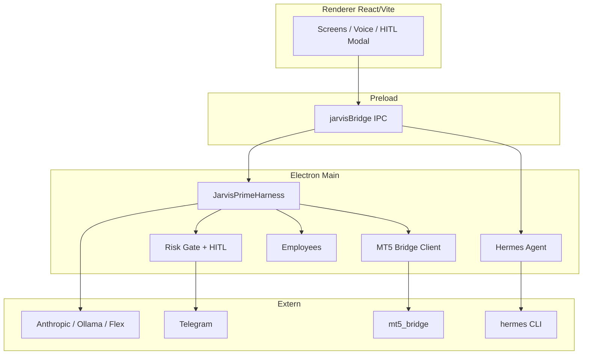

# JARVIS Operations OS

Windows-native **Electron**-Desktop-App: Operations-Kommandozentrale für Trading, Voice, Agent-Harness und Integrationen.

**Primärsprache:** Deutsch · **Repo:** privat · **Version:** 1.0.0

---

## Was ist dieses Projekt?

JARVIS Ops OS ist kein Python-„Employee“-Monolith, sondern ein **modularer Ops-Shell** mit:

| Baustein                 | Rolle                                                            |
| ------------------------ | ---------------------------------------------------------------- |
| **Hermes Agent Brain**   | Voice-/Bridge-Completion mit lokalen Tools                       |
| **JARVIS Prime Harness** | Agent-Schleifen, Risk Gate, Governance, Benchmarks               |
| **HITL**                 | Human-in-the-Loop: In-App-Modal + Telegram `/ok` / `/deny`       |
| **ZeusEdge / MT5**       | Trading-UI + Python-Bridge; Orders hinter HITL                   |
| **Voice**                | Whisper-STT, SpeechSynthesis/Piper-TTS, Hermes-Routing           |
| **Employees**            | E-Mail, Rechnung, Kalender, Shop — Vertrag + IPC, teils Scaffold |
| **Composio**             | Katalog ~485 Apps; Ausführung gated / credential-abhängig        |

Irreversible Aktionen (Orders, Löschungen, Zahlungen) bleiben hinter dem Risk Gate und HITL.

---

## Was kann es?

Status aus dem Fähigkeitsbericht und Admin-Connections (Stand Aug 2026). **HAVE** = nutzbar im Codepfad · **PARTIAL** = verdrahtet, Live abhängig von Keys/Sidecars · **MISSING** = geplant oder nur Scaffold.

| Bereich                                       | Status                 | Kurz                                                     |
| --------------------------------------------- | ---------------------- | -------------------------------------------------------- |
| Desktop Launch (`.bat` / `.vbs` / Dev)        | **HAVE**               | Electron + Vite Dev / gebauter Start                     |
| Harness Agent Loop + Risk Gate                | **HAVE**               | Tools, G08/G11/G14 Bench @ 100                           |
| HITL (App + Telegram) + Gate Memory           | **HAVE**               | Unified Hub; kein Auto-Green für Trading/Destructive     |
| Hermes Voice / Router (Telegram u. a.)        | **HAVE** / **PARTIAL** | Voice + Deliver; Hermes-CLI und Gateway-Start nötig      |
| Whisper STT                                   | **HAVE**               | Lokal (`language: german`)                               |
| TTS                                           | **PARTIAL**            | SpeechSynthesis + optional Piper; kein ElevenLabs        |
| MT5 / ZeusEdge / Prop Maxing / Paper          | **HAVE** / **PARTIAL** | Bridge + UI; Live-Orders brauchen Bridge-Prozess + HITL  |
| Composio                                      | **PARTIAL**            | Katalog live; Execute/OAuth operator-seitig              |
| Employee E-Mail / Rechnung / Kalender / Shop  | **PARTIAL** / Scaffold | Classify/Draft/Preview; Live-IMAP/OAuth/Booking begrenzt |
| Workflows DAG, Command Palette, Kill-Switch   | **HAVE**               | UI + Main verdrahtet                                     |
| NSIS / Auto-Update / 24/7 Service             | **PARTIAL**            | Builder + Updater konfiguriert; Service Scaffold         |
| Chroma / vollständige Python-Employee-Runtime | **MISSING**            | Nicht in diesem Repo                                     |

Details: [`docs/JARVIS-CAPABILITY-REPORT.md`](docs/JARVIS-CAPABILITY-REPORT.md), [`docs/ADMIN-CONNECTIONS.md`](docs/ADMIN-CONNECTIONS.md).

---

## Fertigstellungsgrad (ehrlich)

Zwei Metriken — nicht vermischen:

| Metrik                                                                                      | Schätzung             | Quelle                                                                                              |
| ------------------------------------------------------------------------------------------- | --------------------- | --------------------------------------------------------------------------------------------------- |
| **Richtung „12 von 10“** (maschinell erzwungene Gates: doctor, secrets, verify, ratchet, …) | ca. **58–62 %**       | [`docs/PLAN-12-VON-10.md`](docs/PLAN-12-VON-10.md) — Dimensionen D1–D8 ~8–11/12, kein Claim „12/12“ |
| **Ops-Shell nutzbar** (Launch, Harness, HITL, Trading-UI, Voice-Pfad)                       | hoch / produktionsnah | Capability Report                                                                                   |
| **Vision Employees / Live-Integrationen**                                                   | deutlich niedriger    | Scaffolds + Keys/OAuth + Sidecars                                                                   |

**Voll live** braucht weiterhin Operator-seitig:

- API-Keys / OAuth in **Admin → ◆ CONNECTIONS** (safeStorage; packaged Build liest **kein** `.env`)
- optional: installierter **Hermes Agent**, **Ollama**, laufende **MT5-Bridge**
- Composio-Slugs, Social-Tokens usw. für Shop/Content

Keys allein schalten nicht alles frei — siehe [`docs/ADMIN-CONNECTIONS.md`](docs/ADMIN-CONNECTIONS.md).

---

## So nutzt du es

### Voraussetzungen

- **Windows** 10/11
- **Node.js** ≥ 20, **pnpm** ≥ 10
- Optional: Hermes Agent (venv/`hermes.exe`), Ollama, MetaTrader 5 + `mt5_bridge`, Telegram-Bot

### Installation

```bash
git clone git@github.com:Mr2bussy/jarvis-ops-os.git
cd jarvis-ops-os
pnpm install
```

Falls Electron-Binary fehlt oder pnpm Builds blockiert:

```bash
node node_modules/electron/install.js
pnpm approve-builds
```

### Start

| Weg                               | Befehl / Datei                            |
| --------------------------------- | ----------------------------------------- |
| Desktop / verstecktes Fenster     | `JARVIS-Launch.vbs` → `JARVIS-Launch.bat` |
| Gebauter Start                    | `pnpm run launch`                         |
| Dev (Vite + Electron, Hot Reload) | `pnpm run dev`                            |

### Keys & OAuth

1. App als **Electron** starten (nicht nur Browser-Tab).
2. **Admin / Setup** → Tab **◆ CONNECTIONS**.
3. Keys speichern; **TEST** / **OAUTH ↗** wo angeboten.

### Health

```bash
pnpm verify
```

Läuft u. a. Doctor, Secret-Scan, ESLint, Typecheck, IPC-Check, Tests. Optional: `pnpm smoke:connections` (keine Secrets in der Ausgabe).

---

## Architektur (Kurz)



---

## Repo / Status

- **Privat:** [github.com/Mr2bussy/jarvis-ops-os](https://github.com/Mr2bussy/jarvis-ops-os)
- Vertiefung unter [`docs/`](docs/): Capability Report, Plan 12 von 10, Admin Connections, Production Implementation Status, Threat Model, Runbooks

Secrets gehören **nicht** ins Repo — nur Admin Connections / safeStorage (bzw. lokal `.env` für Dev, nie committen).
