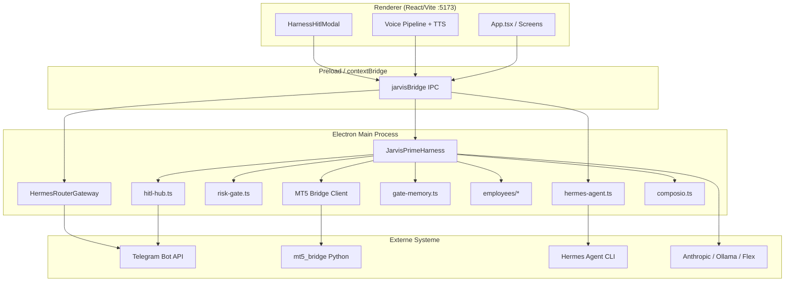

# JARVIS Operations OS — Fähigkeitsbericht

**Version:** 1.0.0 · **Stand:** 24. August 2026  
**Kanonicaler Pfad:** `G:\JAvis og rn`  
**Autor:** JARVIS Prime Harness (Session-Bericht für Operator Zac)

---

## 1. Executive Summary

JARVIS Operations OS ist eine Windows-native Electron-Anwendung, die als **Operations-Kommandozentrale** für Trading, Voice-Interaktion, Agent-Automatisierung und externe Integrationen dient. Im Gegensatz zu einer monolithischen Python-„Employee“-Runtime ist dieses Produkt ein **modularer Desktop-Shell** mit:

- **Hermes Agent Brain** für Voice/Bridge-Completion mit lokalen Tools
- **JARVIS Prime Harness** für agentische Schleifen, Governance und Benchmarks
- **Hermes Router Gateway** für Telegram/Discord/Slack
- **ZeusEdge v2** Trading-Oberfläche mit MT5-Bridge
- **Composio-Integration** für ~485 externe Apps

Diese Session hat den **Launch-Blocker** behoben (fehlende Electron-Binary, stale Git-Lock), die Dev-Umgebung verifiziert und **P0/P1/P2-Roadmap-Grundlagen** implementiert: unified HITL (App + Telegram), Gate-Memory, Employee-Scaffolds (E-Mail, Rechnung, Kalender, Shop), Paper-Trading-Caps, Smart-Tier-Router und ZeusEdge-Risiko-Strip.

**Reifegrad (ehrlich):** Desktop-Shell und Harness **produktionsnah**; Employee-Agents **scaffolded** (Regeln + IPC, keine Live-IMAP/OAuth); 24/7-Service-Modus und NSIS-Installer **geplant**.

---

## 2. Produktvision & Positionierung

### 2.1 Vision

JARVIS soll **≥70 % typischer Operator-Last** übernehmen — klassifiziert, entworfen, vorbereitet — während **irreversible Aktionen** (Orders, Löschungen, Zahlungen, Buchungen) immer hinter einem **Human-in-the-Loop (HITL)**-Gate liegen.

### 2.2 Positionierung

| Dimension | JARVIS Ops OS                              | Python „Employee“-Monolith (Vision-Chat) |
| --------- | ------------------------------------------ | ---------------------------------------- |
| Runtime   | Electron + Node Main + React Renderer      | Python main.py + Celery                  |
| Secrets   | safeStorage, kein Renderer-Zugriff         | .env / Vault variabel                    |
| Trading   | MT5-Bridge + Risk Gate                     | Direkt/API                               |
| Voice     | Whisper STT + SpeechSynthesis TTS + Hermes | ElevenLabs-class (geplant)               |
| Gates     | Harness risk-gate + HITL Queue             | /ok Telegram (geplant überall)           |
| Memory    | JSON-Index + Embeddings (Hybrid)           | ChromaDB (fehlt)                         |

**Bottom line:** Stärkerer **Windows-Ops-Shell + Hermes + Harness**; Employee-Pipelines (E-Mail→Rechnung→Buchung) sind **begonnen, nicht fertig**.

---

## 3. Architekturübersicht



### 3.1 Schichtenmodell

| Schicht                | Pfad                             | Rolle                          |
| ---------------------- | -------------------------------- | ------------------------------ |
| Immutable Constitution | `AGENTS.md`, Karpathy Rules      | Nicht schwächen                |
| Continual Harness      | `userData/harness/`              | Refine, Skills, Snapshots      |
| Agent Loop             | `electron/harness/agent-loop.ts` | Pi-Pattern Tool-Loop           |
| Governance             | `electron/harness/governance/`   | Risk, HITL, Anti-Early-Victory |
| Memory                 | `electron/harness/memory/`       | Token + Semantic Search        |
| Gateway                | `electron/gateway/`              | Hermes Router, Inbound Handler |
| Renderer               | `src/`                           | HUD, Trading, Workflows        |

---

## 4. Modul-Fähigkeitsmatrix

| Modul                    | Status             | Details                                                      |
| ------------------------ | ------------------ | ------------------------------------------------------------ |
| Desktop Launch           | **HAVE**           | `JARVIS.lnk` → `JARVIS-Launch.vbs` → `.bat` → `pnpm run dev` |
| Hermes Agent Voice       | **HAVE**           | `hermes-agent.ts`, In-Process-Session-Memory                 |
| Voice STT (Whisper)      | **HAVE**           | `electron/stt/free-whisper.ts`                               |
| Voice TTS                | **PARTIAL → NEW**  | `voice-tts.ts` + `JARVIS_VOICE_PERSONA`; kein ElevenLabs     |
| Harness Agent Loop       | **HAVE**           | Tools: read/write, web_search, browser_task, mt5_call        |
| Risk Gate                | **HAVE**           | G08/G11/G14 @ 100 in Bench                                   |
| HITL Unified             | **NEW**            | App-Modal + Telegram `/ok`/`/deny` via `hitl-hub.ts`         |
| Gate Memory              | **NEW**            | Auto-Green nach N Approvals (`gate-memory.ts`)               |
| Hermes Router            | **HAVE**           | Telegram/Discord/Slack Polling                               |
| MT5 / ZeusBot            | **HAVE**           | `mt5_bridge/`, `zeus-bot.tsx`                                |
| ZeusEdge v2 Tabs         | **PARTIAL → NEW**  | COCKPIT/CHART/INTEL + Risiko-Strip in INTELLIGENCE           |
| Prop Maxing              | **HAVE**           | `prop-accounts.ts` — Mirror-Sizing, keine Lot-Kopie          |
| Paper Trading            | **NEW**            | `paper-trading.ts` — harte €-Caps                            |
| Quant / VaR              | **HAVE**           | `quant.ts` — ehrliche Refusals                               |
| Workflows DAG            | **HAVE**           | `src/screens/workflows/`                                     |
| Composio                 | **PARTIAL**        | Live-Katalog; Ausführung gated                               |
| Email Employee           | **NEW (Scaffold)** | Klassifikation + Draft + IMAP-Status IPC                     |
| Invoice Employee         | **NEW (Scaffold)** | Text-Extraktion + Buchungsvorschau                           |
| Calendar Employee        | **NEW (Scaffold)** | Konfliktcheck + OAuth-Status                                 |
| Shop Employee            | **NEW (Scaffold)** | Refund/Social/List Shell                                     |
| Smart Tier Router        | **NEW (Scaffold)** | tier1/2/3 + JSON-Repair                                      |
| E-commerce Screen        | **PARTIAL**        | UI vorhanden                                                 |
| 24/7 Service / NSIS      | **PLANNED**        | Dev-Mode only                                                |
| Chroma / Python Employee | **PLANNED**        | Nicht in diesem Repo                                         |

---

## 5. Voice & Hermes Brain Stack

### 5.1 Pipeline

1. **STT:** Lokal Whisper (`language: german`)
2. **Routing:** `talk-route.ts` → Hermes Agent oder `routedComplete`
3. **Hermes:** `hermesAgentComplete()` — `-q`, `--yolo`, kein `--continue` (Win32-Fix)
4. **TTS:** `speak()` mit deutscher Stimmenwahl, `softenForSpeech()`, Timer-Fallback

### 5.2 Persona (Session-Update)

- **Hermes systemHint:** Entspannt, natürliches Deutsch, keine Military-Phrasen
- **TTS Defaults:** `JARVIS_VOICE_PERSONA` — rate 0.88, pitch 0.92, lang de-DE
- **Stimmen-Ranking:** Neural/Katja/Stefan bevorzugt; Google down-ranked

### 5.3 Bekannte Limits

- SpeechSynthesis-Qualität plattformabhängig (Windows OneCore)
- Kein ElevenLabs/streaming TTS
- Hermes erfordert installiertes `hermes.exe` im venv

---

## 6. Harness, HITL, Governance, Risk Gate

### 6.1 Risk Gate (`risk-gate.ts`)

Klassifiziert Tool-Aufrufe: `read | write | browser | shell | trading | destructive`

- **Shell/MT5-Orders/Browser-Mutationen:** HITL when armed
- **web_search + Secrets:** destructive (Exfiltration)
- **G14:** MT5 `order_send` → requiresHitl ✅

### 6.2 HITL Queue + Unified Hub

| Kanal    | Mechanismus                                    |
| -------- | ---------------------------------------------- |
| In-App   | `HarnessHitlModal` — Approve/Deny (DE)         |
| Telegram | `/ok <id>` / `/deny <id>` — `hitl-hub.ts`      |
| IPC      | `harness:hitl-pending`, `harness:hitl-resolve` |

Telegram-Benachrichtigung enthält: Grund, Tool, Risiko-Klasse, ID-Suffix.

### 6.3 Gate Memory (`gate-memory.ts`)

- Fingerprint: `tool + riskClass + normalizedArgs`
- Nach **3 Approvals** → Auto-Green für `browser`/`shell`-Klasse
- **Niemals** Auto-Green für `destructive` oder `trading`

### 6.4 Benchmark Safety

- `pnpm exec vitest run electron/harness/bench.test.ts` — **8/8 pass**
- G08, G11, G14 deterministisch @ 100

---

## 7. Trading / ZeusEdge / MT5 Bridge

### 7.1 MT5 Bridge

- Python `mt5_bridge/bridge.py` — Main-only, `X-JARVIS-Token`
- IPC `mt5:*` — Orders nur mit HITL

### 7.2 ZeusEdge v2 (`TradingContent.tsx`)

| Tab          | Inhalt                                                   |
| ------------ | -------------------------------------------------------- |
| COCKPIT      | Widget-Desk, Drag-Drop Layout                            |
| CHART / FLOW | GodModeChart, Order Flow                                 |
| INTELLIGENCE | Setup-Presets + **VaR/DD/Sharpe/Paper-Caps Strip** (NEU) |

### 7.3 Prop Maxing (`prop-accounts.ts`)

- **Risk Intent**, nicht Lot-Kopie
- Per-Account Rules: daily loss, trailing DD, news ban, copy-trading flag

### 7.4 Paper Trading (`paper-trading.ts`) — NEU

- Portfolio mit `maxDailyLossEur`, `maxRiskPerTradeEur`
- `applyPaperSignal()` — lehnt ab wenn Caps überschritten
- **Keine Live-Orders** — reine Simulation

---

## 8. Integrationen

| Integration      | Status   | Konfiguration                            |
| ---------------- | -------- | ---------------------------------------- |
| Composio         | PARTIAL  | `COMPOSIO_API_KEY` in Setup              |
| Telegram         | HAVE     | `TELEGRAM_BOT_TOKEN`, `TELEGRAM_CHAT_ID` |
| Discord          | HAVE     | Bot Token + Channel                      |
| Slack            | HAVE     | Webhook URL                              |
| Google Calendar  | Scaffold | `GOOGLE_CALENDAR_TOKEN` — Status-IPC     |
| IMAP E-Mail      | Scaffold | `IMAP_HOST/USER/PASSWORD`                |
| Anthropic / Flex | HAVE     | safeStorage Keys                         |
| Ollama           | HAVE     | Lokaler Fallback                         |

---

## 9. Workflows & Automation

- **Workflow Builder:** DAG in `src/screens/workflows/`
- **Cron (Main):** Morning Briefing 07:00 UTC, Weekly Eval Montag 06:00 UTC
- **Browser Task:** `browser_task` Harness-Tool — gated
- **Employee IPC:** `employee:*` Handler für E-Mail/Rechnung/Kalender/Shop

---

## 10. Security Model

1. Renderer **nie** Secrets — `contextBridge` only
2. File IPC: `isPathInRoots` Allowlist
3. `console:runCmd` / `apps:launch cmd`: Advanced Mode + Audit
4. MT5: Token + Main-only
5. Packaged builds: **kein** `.env` — safeStorage only
6. Secret-shaped web_search → destructive HITL
7. Pre-commit: `scan-secrets.mjs`

---

## 11. Changelog dieser Session (2026-08-24)

### Launch-Fixes

- Stale `.git/index.lock` entfernt
- `node_modules/electron/install.js` — Binary fehlte nach pnpm (postinstall blockiert)
- `JARVIS-Launch.bat` — auto `electron install.js` Fallback

### P0 Implementiert

- Voice humanization: `JARVIS_VOICE_PERSONA`, Hermes persona hint
- HITL unified: `hitl-hub.ts`, Telegram `/ok`/`/deny`, DE Modal

### P1 Implementiert / Scaffolded

- Email: `electron/employees/email.ts` + IPC
- Invoice: `electron/employees/invoice.ts` + IPC
- Calendar: `electron/employees/calendar.ts` + IPC
- Gate Memory: `gate-memory.ts` in Harness
- ZeusEdge: Risiko-Strip in INTELLIGENCE Tab
- Paper Trading: `src/lib/paper-trading.ts`

### P2 Implementiert / Scaffolded

- Smart Tier Router: `tier-router.ts` (tier1/2/3 + JSON repair)
- Shop Employee: `electron/employees/shop.ts` + IPC

---

## 12. Bekannte Lücken & Next Sprint

| Priorität | Item                   | Nächster Schritt                             |
| --------- | ---------------------- | -------------------------------------------- |
| P0        | ElevenLabs-class TTS   | Optional Cloud TTS Provider                  |
| P1        | Live IMAP Watch        | node-imap oder Composio Gmail                |
| P1        | PDF OCR                | pdf-parse + Vision fallback                  |
| P1        | Google Calendar Insert | OAuth Flow in Setup                          |
| P1        | sevDesk/Lexoffice API  | Nach Invoice-Preview Gate                    |
| P2        | Chroma Memory          | Persistent employee memory                   |
| P2        | OmniRoute Free Tiers   | Router integration                           |
| P3        | NSIS Installer         | `pnpm run build:win` + safeStorage migration |
| P3        | 24/7 ohne Vite         | Packaged app + Windows Service               |

---

## 13. Start & Betrieb

### 13.1 Voraussetzungen

- Node.js ≥ 20, pnpm ≥ 10
- Windows 10/11
- Optional: Hermes Agent venv, MT5, Telegram Bot

### 13.2 Erstinstallation

```bat
cd /d "G:\JAvis og rn"
pnpm install
node node_modules\electron\install.js
pnpm approve-builds
```

### 13.3 Start (Dev)

```bat
cd /d "G:\JAvis og rn"
pnpm run dev
```

**Oder:** Desktop-Shortcut `%USERPROFILE%\Desktop\JARVIS.lnk`  
→ `G:\JAvis og rn\JARVIS-Launch.vbs` (verstecktes Fenster)

### 13.4 Verifikation

```bat
pnpm exec tsc --noEmit
pnpm exec tsc -p electron/tsconfig.json --noEmit
pnpm exec vitest run electron/harness/bench.test.ts
```

Erwartung: Vite `http://127.0.0.1:5173`, Electron-Fenster, keine TS-Fehler.

### 13.5 Telegram HITL

1. Bot-Token + Chat-ID in Setup
2. Bei HITL-Warte: Nachricht mit `/ok <id-suffix>` oder `/deny <id-suffix>`

---

## 14. Verifikationsnachweise (diese Session)

| Check                                              | Ergebnis                              |
| -------------------------------------------------- | ------------------------------------- |
| `pnpm exec tsc --noEmit`                           | ✅ Pass                               |
| `pnpm exec tsc -p electron/tsconfig.json --noEmit` | ✅ Pass                               |
| Vitest touched (43 tests)                          | ✅ Pass                               |
| `electron/harness/bench.test.ts` (8 tests)         | ✅ Pass                               |
| Vite :5173                                         | ✅ Listening                          |
| Electron process                                   | ✅ Started (dev:electron)             |
| `electron.exe` exists                              | ✅ After install.js                   |
| Shortcut target                                    | ✅ `G:\JAvis og rn\JARVIS-Launch.vbs` |

---

## 15. Anhang — Dateipfade (Session)

| Bereich           | Pfad                                                       |
| ----------------- | ---------------------------------------------------------- |
| Launch            | `JARVIS-Launch.vbs`, `JARVIS-Launch.bat`                   |
| HITL Hub          | `electron/harness/governance/hitl-hub.ts`                  |
| Gate Memory       | `electron/harness/governance/gate-memory.ts`               |
| Employees         | `electron/employees/*.ts`                                  |
| Tier Router       | `electron/harness/swarm/tier-router.ts`                    |
| Paper Trading     | `src/lib/paper-trading.ts`                                 |
| Voice Persona     | `src/lib/voice-tts.ts`, `electron/gateway/hermes-agent.ts` |
| ZeusEdge Strip    | `src/screens/TradingContent.tsx` (MySetupTab)              |
| Capability Report | `docs/JARVIS-CAPABILITY-REPORT.md`                         |
| Production Status | `docs/PRODUCTION-IMPLEMENTATION-STATUS.md`                 |

---

## 16. Production Features (Elite-Tips Upgrade)

**Stand:** 24. August 2026 — siehe `docs/PRODUCTION-IMPLEMENTATION-STATUS.md` für vollständige Tabelle.

### Neu implementiert

| Bereich         | Feature                                                                                      |
| --------------- | -------------------------------------------------------------------------------------------- |
| **Employees**   | Contract (`Employee` interface), `BaseEmployee` State Machine, Registry, 4 Klassen-Employees |
| **Persistence** | Outbox, Idempotency, Audit-Trail (hash chain), SQLite mit JSON-Fallback                      |
| **Governance**  | HITL Timeout/Eskalation, Kill-Switch (`/panic`), Feature Flags                               |
| **AI**          | LLM Provider DI, Tier-Router Confidence, Embedding LRU Cache, Hermes Warm Pool               |
| **Security**    | Token-Bucket Rate Limiter, Path-Traversal Fuzz Tests                                         |
| **Ops**         | Graceful Shutdown, Structured Logging (pino), Config Export                                  |
| **UX**          | Command Palette (Ctrl+K), Employee Transparency Panel, Setup Rotation Hint                   |
| **Deploy**      | electron-updater config, NSIS (bestehend)                                                    |

### Benchmarks

G08/G11/G14 Safety-Cases müssen bei 100 bleiben — `pnpm exec vitest run electron/harness/bench.test.ts`.

---

_Ende des Berichts — JARVIS Prime Harness, kanonischer Pfad G:\JAvis og rn_
